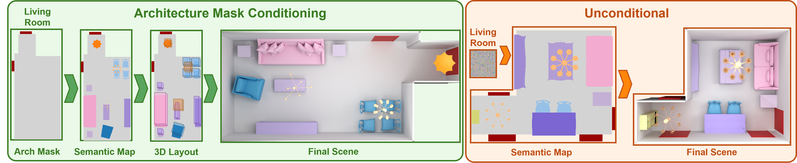

# SemLayoutDiff

<p align="center">
  <strong>Official PyTorch implementation of "SemLayoutDiff: Semantic Layout Diffusion for 3D Indoor Scene Generation"</strong>
</p>

<p align="center">
  <a href="https://sun-xh.github.io/">Xiaohao Sun</a><sup>1</sup>, 
  <a href="https://dv-fenix.github.io/">Divyam Goel</a><sup>2</sup>, 
  <a href="https://angelxuanchang.github.io/">Angel X. Chang</a><sup>1,3</sup>
</p>

<p align="center">
  <sup>1</sup>Simon Fraser University <sup>2</sup>CMU <sup>3</sup>Alberta Machine Intelligence Institute (Amii)
</p>

<p align="center">
  <a href="https://3dlg-hcvc.github.io/SemLayoutDiff/">🌐 Project Website</a> | 
  <a href="https://arxiv.org/abs/2508.18597v1">📄 Paper</a> | 
  <a href="#">🎮 Demo</a>
</p>

<p align="center">
  
</p>


## 🚀 Quick Start

### Installation

1. **Clone the repository**
```bash
git clone https://github.com/3dlg-hcvc/SemLayoutDiff.git
cd SemLayoutDiff
```

2. **Set up the environment**
```bash
conda env create -f environment.yml
conda activate semlayoutdiff

# Install semlayoutdiff
pip install -e .

# Install ai2thor for libsg build
pip install --extra-index-url https://ai2thor-pypi.allenai.org ai2thor==0+8524eadda94df0ab2dbb2ef5a577e4d37c712897
```

### 📦 Pretrained Weights

We provide pretrained weights for both model components to enable quick scene generation without training from scratch.

**Download Links:**
- **SLDN (Semantic Layout Diffusion Network)**: [link](https://aspis.cmpt.sfu.ca/projects/semdifflayout/checkpoints/sldn_checkpoints.tar.gz)
- **APM (Attribute Prediction Model)**: [link](https://aspis.cmpt.sfu.ca/projects/semdifflayout/checkpoints/apm_checkpoint.ckpt)

**Setup:**
```bash
# Create checkpoints directory
mkdir -p checkpoints && cd checkpoints

# Download and extract pretrained weights
# SLDN weights
wget [SLDN_DOWNLOAD_LINK] -O checkpoints/sldn_checkpoints.tar.gz
tar -xf sldn_checkpoints.tar.gz

# APM weights  
wget [APM_DOWNLOAD_LINK] -O apm_checkpoints.ckpt
```

## 📊 Dataset Preparation

Our processed datasets are built on the [3D-FRONT](https://tianchi.aliyun.com/dataset/65347) and [3D-FUTURE](https://tianchi.aliyun.com/dataset/65347) datasets, providing comprehensive 3D indoor scene layouts and furniture models for training and evaluation.

### Quick Start (Recommended)

Download our preprocessed datasets to get started immediately:

```bash
# Create datasets directory and download processed data
mkdir -p datasets && cd datasets
wget [DOWNLOAD_LINK] -O 3dfront_processed.tar.gz
tar -xzf 3dfront_processed.tar.gz --strip-components=1 && cd ..
```

**Download Link:** [3D-FRONT Processed Dataset](https://aspis.cmpt.sfu.ca/projects/semdifflayout/data/3dfront_processed.tar.gz)

**What's included:**
- SLDN training data (`unified_w_arch_120x120.npy`) 
- APM training data (`unified_w_arch_3dfront/`)
- 3D-FUTURE model database (`threed_future_model_unified.pkl`)

**Note:** Data splits and metadata are included in the repository under `preprocess/metadata/` (no separate download needed).

### Expected Directory Structure

<details>
<summary>Click to expand directory structure</summary>

```
datasets/
├── unified_w_arch_120x120.npy                # SLDN training data (required!)
├── unified_w_arch_3dfront/                   # APM training dataset
│   ├── train/val/test/                       # Scene data with .json/.png files
├── threed_future_model_unified.pkl           # 3D-FUTURE models
└── results/                                  # Generated outputs
```
</details>

### Alternative: Process Your Own Data

For custom processing, see detailed instructions in [`preprocess/README.md`](./preprocess/README.md).


## 🏋️ Model Training

Our approach consists of two main components that can be trained independently:

1. **Semantic Layout Diffusion Network (SLDN)**: Generates 2D semantic maps from room type conditioning
2. **Attribute Prediction Model (APM)**: Projects 2D semantic maps to full 3D object layouts with attributes

### Training SLDN

Train the semantic layout diffusion model on 3D-FRONT dataset:

```bash
python scripts/train_sldn.py --config configs/sldn/mixed_con_unified_config.yaml
```

**Requirements:**
- **`datasets/unified_w_arch_120x120.npy`** - This file is essential for SLDN training
- The config uses `data_dir: unified_w_arch` and `data_size: 120` which corresponds to this file

### Training APM

Train the attribute prediction model to map semantic layouts to 3D scenes:

```bash
python scripts/train_apm.py --config-path=../configs/apm --config-name=unified_config
```

## 🎨 Scene Generation

### Step-by-Step Generation

#### 1. Semantic Layout Sampling

Generate 2D semantic maps using the trained SLDN:

```bash
python scripts/sample_layout.py
```

#### 2. 3D Scene Generation

Convert semantic layouts to full 3D scenes with the APM:

```bash
python scripts/inference.py
```

**Parameters:**
- `semantic_map_dir`: Directory containing generated semantic layouts
- `room_type`: Must match the room type used in semantic layout generation
- `--checkpoint`: Path to trained APM model (use pretrained or your trained model)
- For custom data inference, use `configs/apm/inference_customize.yaml`

**Output:** Generated 3D scenes are saved as JSON files containing object positions, orientations, scales, and semantic categories.

## 🎨 Scene Rendering

Render generated scenes using the [SmartScenes ToolKit (SSTK)](https://github.com/smartscenes/sstk) for visualization and quantitative evaluation.

### Setup

1. **Install SSTK** following the instructions in their [repository](https://github.com/smartscenes/sstk)
2. **Prepare 3D-FRONT metadata** from [sstk-metadata](https://github.com/smartscenes/sstk-metadata) following their README setup instructions

### Render Semantic Top-Down Views

```bash
NODE_BASE_URL=<your_root_path> ~/path/to/sstk/ssc/render-file.js \
  --assetType scene \
  --assetGroups 3dfModel,3dfTexture \
  --input datasets/results/scenestate_files/your_scene.json \
  --output_dir rendered_scenes \
  --color_by objectType \
  --index preprocess/metadata/semantic_color_index_livingdiningroom.csv \
  --restrict_to_color_index \
  --assetInfo '{"archOptions":{"includeWallHoleBoundingBoxes":true}}'
```

**Parameters:**
- `--input`: Path to generated scenestate JSON file
- `--index`: Semantic color mapping (use `semantic_color_index_bedroom.csv` for bedroom scenes)
- `--output_dir`: Directory for rendered outputs
- `--assetInfo`: Includes walls and doors in rendering with architectural options

The semantic color indices are provided in `preprocess/metadata/` for different room types.

## 📈 Evaluation

Evaluate generated scenes using standard metrics:

```bash
# Evaluate semantic layout quality
python scripts/eval.py --config <path_to_eval_config>
```


## 🎯 Citation

If you find this work useful, please consider citing our paper:

```bibtex
@article{sun2025semlayoutdiff,
  title={{SemLayoutDiff}: Semantic Layout Generation with Diffusion Model for Indoor Scene Synthesis}, 
  author={Xiaohao Sun and Divyam Goel and Angle X. Chang},
  year={2025},
  eprint={2508.18597},
  archivePrefix={arXiv},
}
```

## 🙏 Acknowledgements

Thanks to [Multinomial Diffusion](https://arxiv.org/abs/2102.05379), whose implementations form the foundation of our diffusion models. And thanks to [BlenderProc-3DFront](https://github.com/yinyunie/BlenderProc-3DFront) and [DiffuScene](https://github.com/tangjiapeng/DiffuScene) that our data processing based on their code.


This work was funded in part by a CIFAR AI Chair and NSERC Discovery Grants, and enabled by support from the <a href="https://alliancecan.ca/">Digital Research Alliance of Canada</a> and a CFI/BCKDF JELF.
We thank Ivan Tam for help with running SceneEval; Yiming Zhang and Jiayi Liu for suggestions on figures; Derek Pun, Dongchen Yang, Xingguang Yan, and Manolis Savva for discussions, proofreading, and paper suggestions.